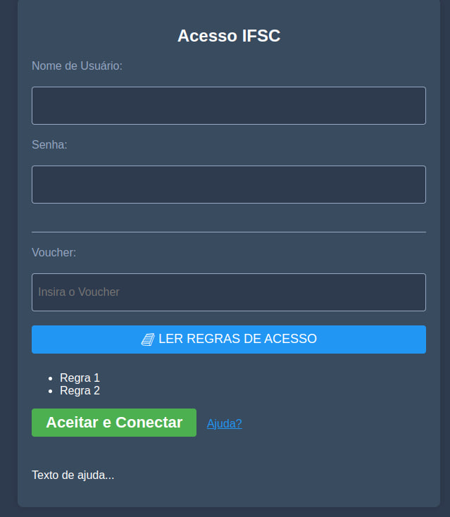

# PORTAL CAPTIVO
Este código implementa um portal captivo para o pfSense com auticação via usuário/senha e voucher. 

> Ele inclui um menu accordion contendo o botão para as Regras de Acesso à Rede

## Funcionalidades

* Responsividade
* Ao inserir texto no usuário, ele desativa o campo Voucher melhorando a usabilidade
* Link de Ajuda para encaminhar o usuário, em caso de dificuldades

## Melhorias

- Analisar se a validação dos campos poder ser melhor usando labels HTML, não pop-up
- Melhorar os scroll das regras pra induzir o usuário ler tudo, hoje podem não notar o botão Aceitar e Conectar
